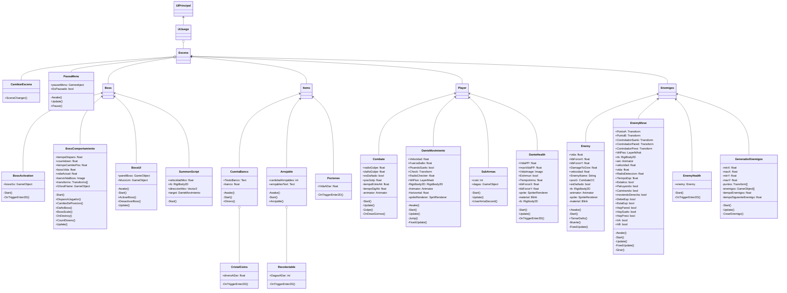

# Dante's Odyssey

  

## PORTADA

  

## INTRODUCCIÓN
El desarrollo de videojuegos es un ámbito que ha venido adquiriendo relevancia en los ultimos años, un apartado de la programación donde este surge a partir de una idea hasta su materialización como un videojuego donde se extiende multidisciplinariamente por diferentes sectores, tales como, la animación, la música, el arte, el diseño gráfico y, la rama que permite la unión de todo esto, la programación 
## ABSTRAC 
The development of video games is a field that has been gaining relevance in recent years, a section of programming where this arises from an idea to its materialization as a video game where it extends multidisciplinary by different sectors, such as animation, music, art, graphic design and the branch that allows the union of all this, programming.

## 1. PLANTEAMIENTO DEL PROBLEMA

### 1.1 DESCRIPCION DEL PROBLEMA
En Colombia el desarrollo de videojuegos aún es una industria muy joven en comparación con países como Japón o Estados Unidos, aparte de que socialmente en Colombia se asocian los videojuegos con la inmadurez y un completo asunto de niños, aunque a nivel global ya para algunas personas el desarrollo y el juego profesional de videojuegos representa un trabajo, en Colombia aún suena extraño pensar en trabajar de esto, y esto hace que los jóvenes opten por otras vías antes de intentar vivir de ello, lo que se ve en la escasez que tienen las casas indies desarrolladoras de videojuegos ubicadas en Colombia que no pueden contratar talento local, sino, que están casi obligadas a contratar talento extranjero
  

### 1.2 OBJETIVOS

### 1.2.1 OBJETIVO GENERAL

 - Crear una adaptación en formato de videojuego de la obra de Dante Alighieri, la divina comedia, a través del uso de tecnologías recientes y la implementación de la Programación Orientada a Objetos

### 1.2.2 OBJETIVOS ESPECÍFICOS

 - Implementacion de conceptos propios de la Programacion Orientada a Objetos
 -  Adaptacion de la narrativa de la Divina Comedia para la linealidad del juego

## 2 MARCO DE REFERENCIA
Para el desarrollo del concepto del videojuego Dante's Odyssey se planeo hacer uso de la historia contada en la Divina Comedia, haciendo uso de los pasajes por los que pasa Dante y el poeta virgilio como escenarios/niveles que permitan al jugador enfrentarse a los distintos pecados de los circulos del infierno.
### 2.1 MARCO CONTEXTUAL 
La obra de Dante Alighieri, la Divina comedia se considera una obra maestra de la literatura italiana y universal, donde el autor resume el conocimiento acumulado desde la antigüedad a su época, donde el autor da a conocer sus convicciones morales y filosóficas, expone su fe a través de los 100 cantos compuestos en terza rima, referenciando a personajes históricos y seres mitológicos de la antigüedad mientras pasa por una odisea para encontrarse con su amada

### 2.2 MARCO TEORICO

 - **Herencia:** uno de los pilares fundamentales de la programacion orientada a objetos, debido a que es el mecanismo que nos permite pasar los atributos y metodos a otra clase, con el fin de reutalizar codigo.
 - **Clase principal:** la clase de la cual se heredan caracteristicas.
 - **Clase hija:** la clase que hereda las caracteristicas de una clase principal, esta clase hija puede modificar y agregar metodos que hereda.
 - **Reutilizacion:** la reutilizacion de codigo permite agilizar la creacion de funcionalidades en un programa 

### 2.3 MARCO LEGAL
La ley que rige en Colombia para la normativa  sobre la operacion y funcionamiento en la prestacion de servicios de videgojuegos, es la ley 1554 de 2012, decretada el 9 de julio de 2012 durante el gobierno de Juan Manuel Santos.

esta ley se define como:

*Artículo 1°. Definición. Para los efectos de la presente ley se entiende por establecimiento de prestación de servicio de videojuegos, aquel que ofrece juegos de video por computador y/o simuladores, o consolas de videojuegos, y/o cualquier otro instrumento, que en su desarrollo utilice imágenes visuales electrónicas o similares. El servicio de videojuegos será prestado por personas naturales o jurídicas, debidamente inscritas en la Cámara de Comercio del lugar en el que cumple su objeto comercial.*

en el tercer articulo de la ley presenta unos criterios de operacion, y siguientemente se resaltaran los mas importantes:

 1. *Atender estrictamente a la clasificación de los videojuegos establecida en el artículo 9° de la presente ley.*
 2. *Verificar que el espacio disponible para cada usuario le permita situarse a la distancia apropiada entre jugador y pantalla, y que la distancia entre los equipos de videojuegos garanticen en todo momento el servicio, la operación, la salud y la seguridad de los usuarios.*
 3. *Obtener el certificado de capacitación en la identificación y manejo de jugadores patológicos e informar a las autoridades cuando sea advertida la presencia de un usuario ludópata o en riesgo de convertirse en ludópata.*

la importancia del noveno articulo de la ley impacta debido al hecho que para comercializar, distribuir o vender un videojuego en Colombia, este debe estar clasificado de la siguiente manera

 1. Videojuego de abierta circulación: Clasificación Todos. Contenidos referidos a:
	 - Entretenimiento educativo. Proporciona al usuario conocimientos específicos, desarrollando o reforzando el aprendizaje por medio de maneras entretenidas.
	 - Deportes
	 - Competencias de vehículos reales o ficticios
	 - Informativo respecto de datos, hechos, información de recursos, o materiales referentes a eventos históricos
	 - Situaciones de naturaleza fantástica que incluyen personajes humanos y no humanos fácilmente distinguibles de la vida real
2. Videojuego de circulación restringida; Clasificación mayores de 18 años con contenidos que hagan apologia, referencia, o uso de: 
	-  Lenguaje soez 
	- Desnudez, sexo o sexualidad
	- Bebidas alcohólicas
	- Drogas ilegales
	- Productos de tabaco
	- Discriminación de cualquier índole
	- Violencia, derramamiento de sangre, armas, lesiones humanas y muerte
	- Apuestas de dinero o propiedades

## 3. METODOLOGIA INGENIERIL
La metodologia usada dentro del proyecto fue una de las metodologias agiles más comunes que es la metodologia Scrum, la cual se enfoca para el trabajo en equipo, para obtener el mejor resultado del proyecto.

La metodologia Scrum esta especializada en entornos de trabajos complejos donde se deben mostrar buenos resultados en cortos lapsos de tiempo, donde el requisito final esta poco definido y se fundamenta en la libertad creativa, la innovacion en los procesos y la flexibilidad de estos mismos

La metodologia Scrum apliacada al proyecto se hace mediante ciclos de corto periodo de tiempo donde se genera un feedback en la iteracion y permite generar en cada iteracion un resultado en el proyecto lo que permite que aumento el valor agregado del proyecto. Todo esto se da a traves de una lista de objetivos que se desea obtener en el proyecto, actuando este como un plan de desarrollo donde se priorizan los objetivos o requerimientos en base al valor que aportan al proyecto por su coste y continua de esta manera por cada iteracion.

## 4. DESARROLLO INGENIERIL

### 4.1 REQUERIMIENTOS 
los requerimientos planteados para el funcionamiento del videojuego se evidencias en la siguiente tabla
| OS | Procesador | Memoria | Graficos | DirectX | Red | Almacenamiento|
|--|--|--|--|--|--|--|
|Windows 7 o superior|Intel Core 2.5 GHz o equivalente  |1 GB Ram|Integrados|Version 11|Conexion a internet|2 GB espacio libre|

### 4.2 MODELADO

    

### 4.3 DESCRIPCIÓN TÉCNICA DEL SISTEMA
Para el desarrollo del proyecto, en su parte tecnica se emplearon 3 pilares, los cuales son: 

1. **Lenguaje:** El lenguaje utilizado para la creacion del proyecto fue C sharp, el cual es un lenguaje multiparadigma desarrollado por Microsoft, este lenguaje estaba estrechamente ligado con el entorno donde se desarrollo el proyecto, debido a la solides de sus librerias que permiten crear un 
2. **Motor Grafico:** El Motor grafico donde se desarrollo el proyecto fue en Unity, Unity es un motor grafico bastante solido y con mucho tiempo en el mercado, Unity guia a los programadores inexpertos durantes sus primeras etapas de desarrollo de tal manera que evita el agobio y la sensacion de fracaso, ya que este facilita ciertos procesos que para un inexperto no le es "necesario" de aprender en primera instancia 
3. **Editor de imagenes:** El editor de imagenes donde se llevo a cabo la creacion del personaje, villanos y enemigos y muchos Sprotes, fue en Aseprite, este software es uno de los más recomendado tanto por expertos como por amantes del Pixel Art debido a que desde su interfaz Aseprite esta fundamentado sobre la creacion de Pixel Art, permitiendo tambien hacer animacion del personaje dentro del mismo software sin necesidad de usar un tercero.

### 4.4 DISEÑO INTERFAZ

## 5. ANÁLISIS ECONÓMICO 
Para el desarrollo se tiene en cuenta el siguiente costo de produccion: 
|Actividades Realizadas| Costo |
|--|--|
|  Horas Totales| 2500000 |
|Distribucion |2000000|
|Equipos | 4000000 |
| Seguro Contra Accidentes|300000|
| Mantenimiento  |  3000000|
|**Costo Total:**|11800000|

En la tabla anterior mostrada se muestra los costos de produccion del videojuego donde este se incluye dentro del mantenimiento, la constante actualizacion de contenido dentro de este para perdurar la mayor cantidad de tiempo posible 

## 6. CONCLUSIONES  

 1. El desarrollo de videojuegos tiene un apartado de complejidad donde su desarrollo se puede hechar cuesta arriba,donde esta complejidad aparece en diferences campos debido al ser esta multidisciplinaria.
 2. La poca aceptacion social que tiene en Colombia todo lo relacionado al apartado de videojuegos puede ser causante de la poca inversion en el talento del pais.

## 7. RECOMENDACIONES

 1. Al desarrollar un juego de Unity con más de una persona, se recomienda principalmente pagar la licencia de "Unity Collaborators, ya que esta, facilitaria mucho el desarrollo del videojuego en cuestion.
 2. El probar diferentes juegos permitiria conocer la manera en que quiere ser desarrollado un videojuego tomando los aspectos positivos que tiene este y tomar precauciones en cuanto a los aspectos negativos o descuidades del juego.

## 8. BIBLIOGRAFIA

1. _Crear tablas en LaTeX_. (s/f). Manualdelatex.com. Recuperado el 16 de noviembre de 2022, de https://manualdelatex.com/tutoriales/tablas

2. _Cris Tales en Steam_. (s/f). Steampowered.com. Recuperado el 16 de noviembre de 2022, de https://store.steampowered.com/app/1079830/Cris_Tales/?l=spanish

3. _DeepL Translate - El mejor traductor del mundo_. (s/f). Deepl.com. Recuperado el 16 de noviembre de 2022, de https://www.deepl.com/es/translator

4. _Ley 1554 de 2012 - Gestor Normativo_. (s/f). Gov.co. Recuperado el 16 de noviembre de 2022, de https://www.funcionpublica.gov.co/eva/gestornormativo/norma.php?i=48325

5. _Lista completa de símbolos en LaTeX_. (s/f). Manualdelatex.com. Recuperado el 16 de noviembre de 2022, de https://manualdelatex.com/simbolos

6. _¿Qué es la Herencia en programación orientada a objetos?_  (2019, junio 5). IfgeekthenNTTdata. https://ifgeekthen.nttdata.com/es/herencia-en-programacion-orientada-objetos

7. _Qué es SCRUM_. (2008, agosto 4). Proyectos Ágiles. https://proyectosagiles.org/que-es-scrum/

8. Torres, S. R. (2021, abril 6).  _Desde Colombia hacia el corazón de los gamers del mundo • Impacto TIC_. Impacto TIC.

9. Wikipedia contributors. (s/f-a).  _Desarrollo de videojuegos_. Wikipedia, The Free Encyclopedia. https://es.wikipedia.org/w/index.php?title=Desarrollo_de_videojuegos&oldid=146436984

10. Wikipedia contributors. (s/f-b).  _Divina comedia_. Wikipedia, The Free Encyclopedia. https://es.wikipedia.org/w/index.php?title=Divina_comedia&oldid=146782318

## ANEXOS 
